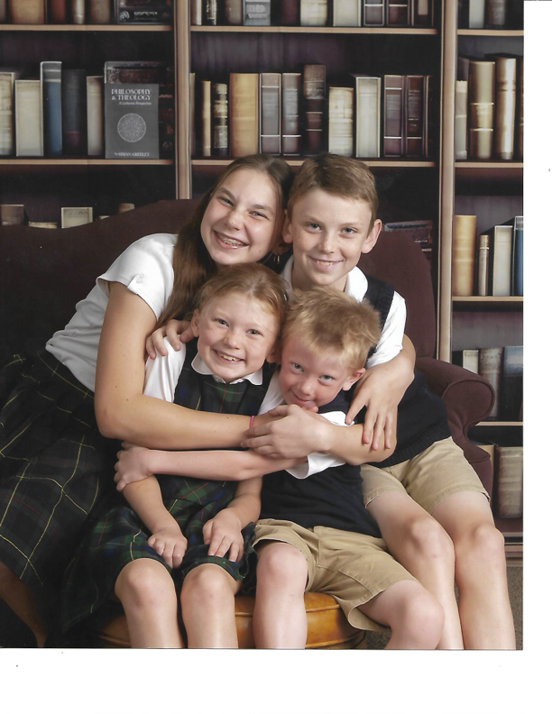

<html lang="en"><head>
    <meta charset="UTF-8">
    <meta name="viewport" content="width=device-width, initial-scale=1.0">
    <title>Miller Family Dental Care — Kokomo, IN</title>
    <!-- Google Fonts -->
    <link rel="preconnect" href="https://fonts.googleapis.com">

    <link rel="preconnect" href="https://fonts.gstatic.com" crossorigin="">

    <link href="https://fonts.googleapis.com/css2?family=Inter:wght@300;400;500;600;700&amp;display=swap" rel="stylesheet">

    

</head>

<body>

    <!-- FLOATING STICKY NAVIGATION BAR CONTAINER -->

    <header>

        

            

                

                Miller Family Dental Care

            

            

            <!-- Quick Anchor Links -->

            <ul class="nav-menu">

                <li><a href="#services" class="nav-link">Services</a></li>

                <li><a href="#why-choose-us" class="nav-link">Why Choose Us</a></li>

                <li><a href="#location" class="nav-link">Location</a></li>

                <li><a href="#appointment" class="nav-link nav-link-btn">Request Appointment</a></li>

            </ul>

        

    </header>

    <!-- INTRODUCTORY BANNER HERO SCREEN -->

    <section class="hero">

        

            

                
Proudly Serving Our Kokomo Community

                <h1>Compassionate care. Practical solutions. Lasting smiles.</h1>

                
Welcome to Miller Family Dental Care. We provide comprehensive, patient-centered dental services for all ages. Our practice combines gentle care, advanced technology, and a comfortable office environment to help your family maintain healthy, confident smiles.

                

                    <a href="#appointment" class="btn">Request Appointment</a>

                    <a href="#services" class="btn btn-outline">Explore Our Services</a>

                

            

            

                

            

        

    </section>

    

    <!-- SERVICES CLUSTERS WITH SYSTEM SVG ICON PACKS -->

    <section id="services" class="section-bg">

        

            

            <!-- Priority Dental Urgent Assistance Alert Bar -->

            

                
!

                

                    <h4>Dental Emergency Care Available</h4>

                    
Experiencing a severe toothache or broken tooth? We provide same-day or next-available priority appointments. Call us immediately at <strong>765.456.3015</strong>.

                

            

            

                <h2>Our Dental Services</h2>

                
From routine prevention to advanced structural corrective therapies, our clinical operations are tailored completely around your lifestyle and oral health goals.

            

            

            

                <!-- Service Item 1 -->

                

                    

                        <svg viewBox="0 0 24 24"><path d="M12,2A3,3 0 0,0 9,5C9,6.05 9.47,7 10.22,7.63C10.05,8.7 9.87,10.74 10.5,12.33C11.08,13.78 12.16,14.67 13.5,14.93V19A1,1 0 0,0 14.5,20A1,1 0 0,0 15.5,19V14.93C16.84,14.67 17.92,13.78 18.5,12.33C19.13,10.74 18.95,8.7 18.78,7.63C19.53,7 20,6.05 20,5A3,3 0 0,0 17,2A3,3 0 0,0 14,5C14,6.05 14.47,7 15.22,7.63C15.09,8.44 14.94,10 15.3,11.16C15.5,11.77 15.93,12.24 16.5,12.44V19C16.5,20.1 15.6,21 14.5,21C13.4,21 12.5,20.1 12.5,19V12.44C13.07,12.24 13.5,11.77 13.7,11.16C14.06,10 13.91,8.44 13.78,7.63C14.53,7 15,6.05 15,5A3,3 0 0,0 12,2M7,7A1,1 0 0,0 6,8A1,1 0 0,0 7,9A1,1 0 0,0 8,8A1,1 0 0,0 7,7M4,10A1,1 0 0,0 3,11A1,1 0 0,0 4,12A1,1 0 0,0 5,11A1,1 0 0,0 4,10M5,14A1,1 0 0,0 4,15A1,1 0 0,0 5,16A1,1 0 0,0 6,15A1,1 0 0,0 5,14Z"></path></svg>

                    

                    <h3>Preventive Care</h3>

                    
Routine cleanings, comprehensive oral exams, targeted dental sealants, and personalized home-care guidance designed to intercept decay and gum disease before they start.

                

                <!-- Service Item 2 -->

                

                    

                        <svg viewBox="0 0 24 24"><path d="M12,2A10,10 0 0,0 2,12A10,10 0 0,0 12,22A10,10 0 0,0 22,12A10,10 0 0,0 12,2M12,4A8,8 0 0,1 20,12A8,8 0 0,1 12,20A8,8 0 0,1 4,12A8,8 0 0,1 12,4M11,7V13H13V7H11M11,15V17H13V15H11Z"></path></svg>

                    

                    <h3>Restorative Dentistry</h3>

                    
High-tier fillings, durable crowns, bridges, and full-mouth rehabilitations focused on rebuilding long-term structural function and natural appearance.

                

                <!-- Service Item 3 -->

                

                    

                        <svg viewBox="0 0 24 24"><path d="M11.5,8C11.5,10 10,11.5 8,11.5C6,11.5 4.5,10 4.5,8C4.5,6 6,4.5 8,4.5C10,4.5 11.5,6 11.5,8M19,11.5C17.62,11.5 16.5,12.62 16.5,14C16.5,15.38 17.62,16.5 19,16.5C20.38,16.5 21.5,15.38 21.5,14C21.5,12.62 20.38,11.5 19,11.5M19.5,4C19.5,5.1 18.6,6 17.5,6C16.4,6 15.5,5.1 15.5,4C15.5,2.9 16.4,2 17.5,2C18.6,2 19.5,2.9 19.5,4M14,15.5C12.34,15.5 11,16.84 11,18.5C11,20.16 12.34,21.5 14,21.5C15.66,21.5 17,20.16 17,18.5C17,16.84 15.66,15.5 14,15.5Z"></path></svg>

                    

                    <h3>Cosmetic Dentistry</h3>

                    
Professional teeth whitening, custom porcelain veneers, and direct cosmetic bonding to enhance, balance, and reveal your ideal smile aesthetic.

                

                <!-- Service Item 4 -->

                

                    

                        <svg viewBox="0 0 24 24"><path d="M19 3H5C3.9 3 3 3.9 3 5V19C3 20.1 3.9 21 5 21H19C20.1 21 21 20.1 21 19V5C21 3.9 20.1 3 19 3M17 12H13V17H11V12H7V10H17V12Z"></path></svg>

                    

                    <h3>Dental Implants</h3>

                    
Single-tooth dental implants and robust implant-supported bridge restorations providing premium, biocompatible long-term tooth replacement options.

                

                <!-- Service Item 5 -->

                

                    

                        <svg viewBox="0 0 24 24"><path d="M12,2A3,3 0 0,1 15,5A3,3 0 0,1 12,8A3,3 0 0,1 9,5A3,3 0 0,1 12,2M11,22V17H9V12A2,2 0 0,1 11,10H13A2,2 0 0,1 15,12V17H13V22H11Z"></path></svg>

                    

                    <h3>Pediatric Dentistry</h3>

                    
Gentle care tailored explicitly for children. Focuses on setting up positive preventive memories, growth milestone assessments, and protective early home guidance.

                

                <!-- Service Item 6 -->

                

                    

                        <svg viewBox="0 0 24 24"><path d="M12,2C11.31,2 10.64,2.13 10.03,2.38C7.57,3.38 6,5.83 6,8.5C6,11.84 8.04,14.36 11,14.89V21A1,1 0 0,0 12,22A1,1 0 0,0 13,21V14.89C15.96,14.36 18,11.84 18,8.5C18,5.83 16.43,3.38 13.97,2.38C13.36,2.13 12.69,2 12,2Z"></path></svg>

                    

                    <h3>Periodontal Care</h3>

                    
Advanced diagnosis and treatment of active gum disease, including precision scaling and root planing alongside proactive long-term tissue maintenance protocols.

                

            

        

    </section>

    <!-- REASSURING FULL WIDTH WELCOME ACCENT BLOCK -->

    <section class="patient-welcome-banner">

        

            

                <h2>Welcoming New Patients &amp; Families</h2>

                
We make transitioning to a new dental office simple and transparent. Your initial reservation involves an extensive systemic check, detailed digital X-rays as required, and an open, zero-pressure treatment discussion with Dr. Paul Miller.

                

                

                    <h4>Insurance &amp; Financing Transparency</h4>

                    
We work in-network with <strong>Delta Dental</strong> and file claims directly for you. Uninsured? Ask our team about our flexible financing paths or join our exclusive <strong>In-House Member Program</strong>.

                

            

            

                <a href="#appointment" class="btn btn-white">Request Registration Info</a>

            

        

    </section>

    <!-- INTAKE RESERVATION FORM SCREEN -->

    <section id="why-choose-us">

        

            

            <!-- Value Prop Accordions -->

            

                

                    <h2>Why Choose Us</h2>

                    
We approach family dentistry differently, blending clinical modern tools with individual respect and continuous medical education.

                

                <ul class="feature-list">

                    <li class="feature-item">

                        

                            <svg viewBox="0 0 24 24"><path d="M21,7L9,19L3.5,13.5L4.91,12.09L9,16.17L19.59,5.59L21,7Z"></path></svg>

                        

                        

                            <h4>Experienced Team</h4>

                            
Dr. Paul Miller and our supporting hygienists stand dedicated to evidence-based conservative treatments and ongoing clinical safety training.

                        

                    </li>

                    <li class="feature-item">

                        

                            <svg viewBox="0 0 24 24"><path d="M21,7L9,19L3.5,13.5L4.91,12.09L9,16.17L19.59,5.59L21,7Z"></path></svg>

                        

                        

                            <h4>Patient Comfort</h4>

                            
Relax within modern operatory treatment rooms featuring ergonomic patient seating and dental sedation paths for anxious individuals.

                        

                    </li>

                    <li class="feature-item">

                        

                            <svg viewBox="0 0 24 24"><path d="M21,7L9,19L3.5,13.5L4.91,12.09L9,16.17L19.59,5.59L21,7Z"></path></svg>

                        

                        

                            <h4>Advanced Technology</h4>

                            
Utilizing high-definition digital X-rays, intraoral cameras, and modern sterilization stations for highly accurate diagnosis and optimal care safety.

                        

                    </li>

                    <li class="feature-item">

                        

                            <svg viewBox="0 0 24 24"><path d="M21,7L9,19L3.5,13.5L4.91,12.09L9,16.17L19.59,5.59L21,7Z"></path></svg>

                        

                        

                            <h4>Personalized Treatment</h4>

                            
We design specific treatment paths scaled dynamically around your unique oral health criteria, schedule preferences, and personal financial framework.

                        

                    </li>

                </ul>

            

            

            <!-- Online Appointment Request Intake Form Block -->

            

                <h3>Online Appointment Request</h3>

                
Submit your preferred times below. Our front desk team will contact you shortly to confirm your reservation details.

                <form action="https://api.web3forms.com/submit" method="POST">
                    <input type="hidden" name="access_key" value="b7557e9b-c049-412a-bac1-6c18924f15dc">
                    

                        <label for="name">Full Name</label>
                        <input type="text" name="name" class="form-control" placeholder="John Doe" required="">
                    

                    

                        

                            <label for="form-phone">Phone Number</label>
                            <input type="tel" name="phone" id="form-phone" class="form-control" placeholder="(765) 555-0123" required="">

                        

                        

                            <label for="form-email">Email Address</label>
                            <input  type="email" name="email" id="form-email" class="form-control" placeholder="john@example.com" required="">
                        

                    

                    

                        <label for="service-type">Desired Service</label>
                        <select name="service" id="service-type" class="form-control">
                            <option value="routine-cleaning">Routine Cleaning &amp; Exam</option>
                            <option value="pediatric">New Patient Visit</option>
                            <option value="emergency">Emergency Dental Visit</option>
                            <option value="cosmetic">Cosmetic / Whitening Consultation</option>
                            <option value="other">Other Dental Inquiry</option>
                        </select>
                    

                    

                        <label for="message">Additional Notes or Preferred Availability</label>
                        <textarea id="message" name="message" class="form-control" placeholder="e.g., Tuesday mornings preferred, questions about dental insurance, etc."></textarea>
                    

                    <button type="submit" class="btn" style="width: 100%; padding: 16px;">Submit Scheduling Request</button>
                </form>
            

        

    </section>

    

    <!-- GEOGRAPHIC LOGISTICS & HOUR MATRICES -->

    <section class="section-bg" id="location">

        

            

                

                    <h2>Get In Touch</h2>

                    
Have a question or ready to schedule your appointment? Reach out via phone, email, or stop by our clean, accessible facility.

                

                

                

                    <h3>Office Location</h3>

                    
200 S Dixon Rd. Kokomo, IN 46901

                

                

                    <h3>Hours of Operation</h3>

                    
Monday – Thursday: 8:30 AM – 5:00 PM

                

                

                    <h3>Direct Communication</h3>

                    
Phone: <a href="tel:7654563015">765.456.3015</a>

                    
Email: <a href="mailto:millerfamilydentalcare@gmail.com">millerfamilydentalcare@gmail.com</a>

                

            

            

            <!-- Safe Native Google Map Layer -->

            

                <iframe title="Miller Family Dental Care Location Map" src="https://maps.google.com/maps?q=200%20S%20Dixon%20Rd,%20Kokomo,%20IN%2046901&amp;t=&amp;z=15&amp;ie=UTF8&amp;iwloc=&amp;output=embed" allowfullscreen="" loading="lazy">

                </iframe>

            

        

    </section>

    <!-- COMPREHENSIVE MEDICAL BRAND FOOTER -->

    <footer>

        

            

                

                    <h3>Miller Family Dental Care</h3>

                    
Compassionate care. Practical solutions. Lasting smiles.

                    

                    <!-- Direct Dynamic Facebook Button link -->

                    <a href="https://www.facebook.com/paulandbrittamiller/" target="_blank" rel="noopener noreferrer" class="fb-link-btn">

                        <svg viewBox="0 0 24 24"><path d="M22 12c0-5.52-4.48-10-10-10S2 6.48 2 12c0 4.84 3.44 8.87 8 9.8V15H8v-3h2V9.5C10 7.57 11.57 6 13.5 6H16v3h-2c-.55 0-1 .45-1 1v2h3v3h-3v6.95c4.56-.93 8-4.96 8-9.8z"></path></svg>

                        Follow Us on Facebook

                    </a>

                

                

                

                    <h4>Patient Quick Resources</h4>

                    
• New Patient Registration Forms are available at the front desk for streamlined check-in.

                    
• Dental emergencies are prioritized during regular office hours.

                

            

            

                
© Miller Family Dental Care. All Rights Reserved. Comforting families across Kokomo, Indiana since 1979.

                
Dr. Paul Miller, DDS

            

        

    </footer>
</body></html>
